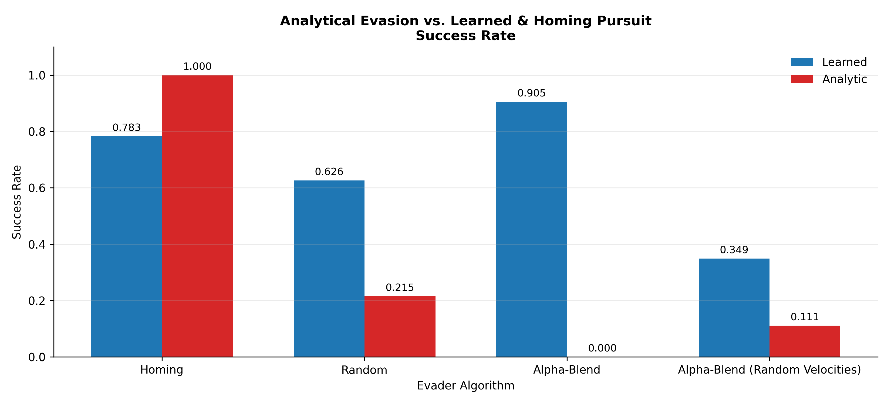
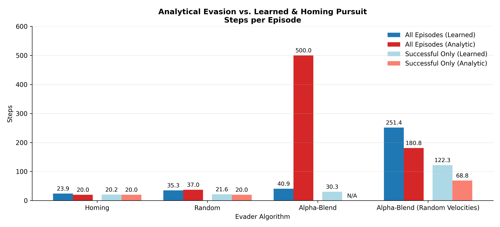
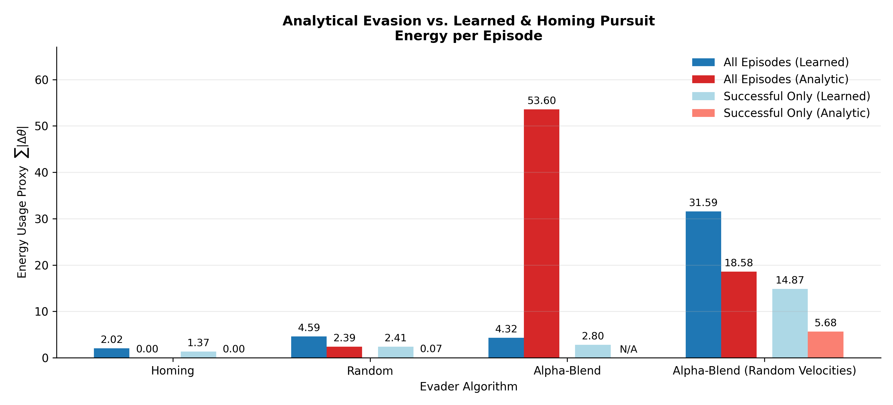
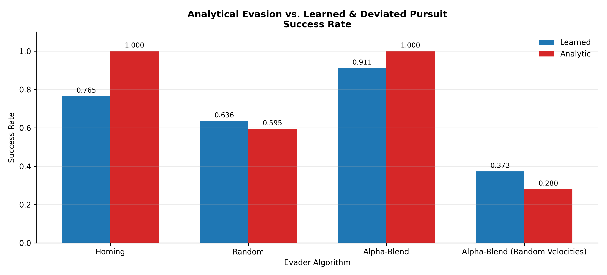
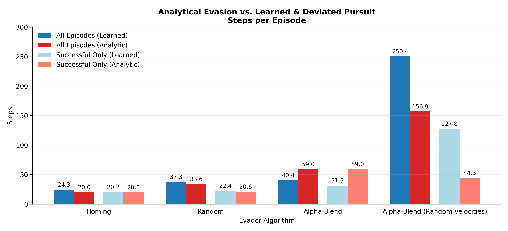
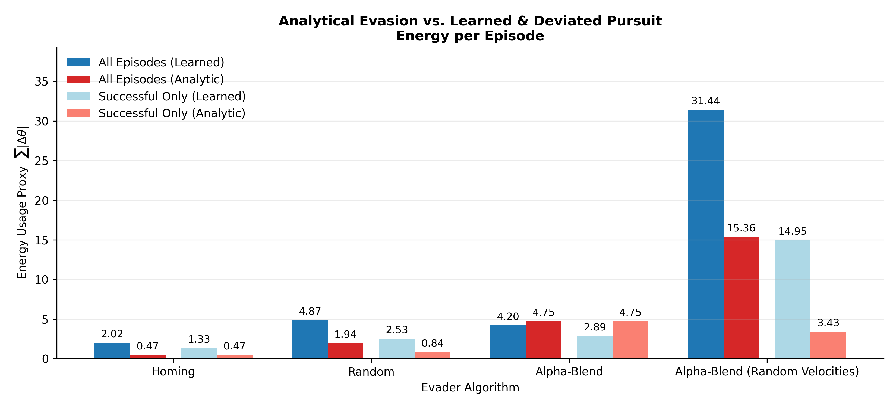
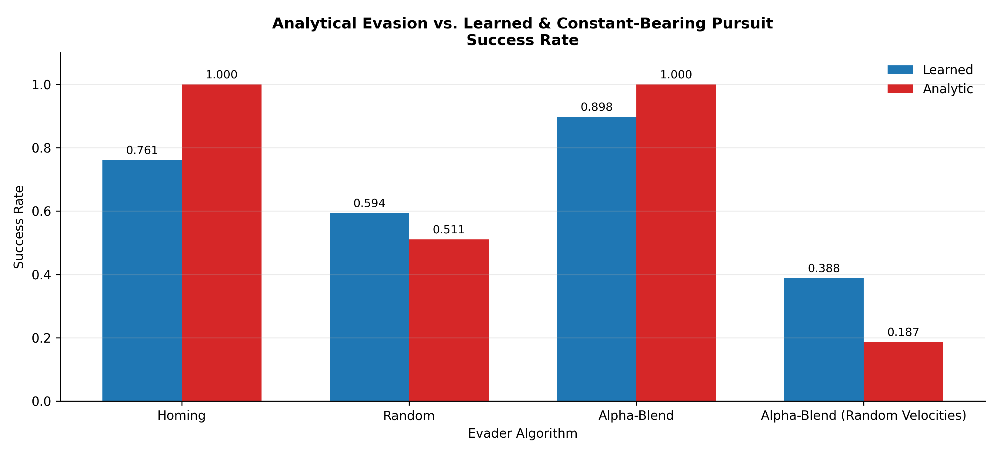
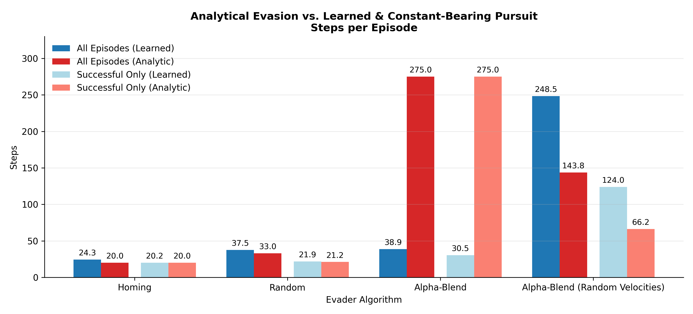
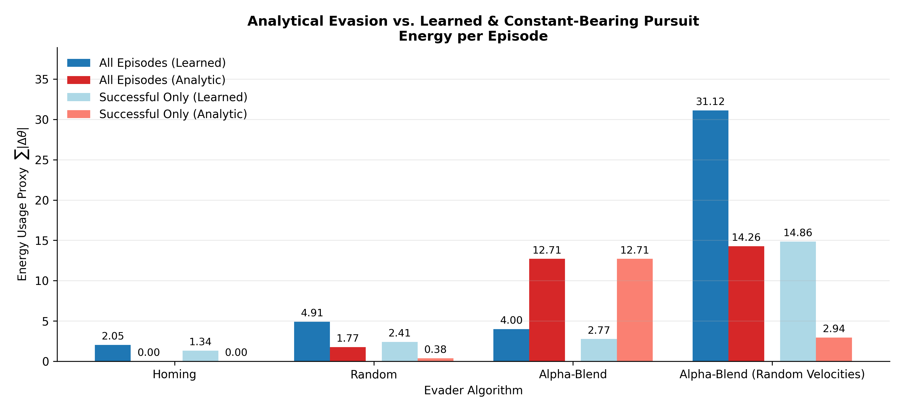

# Evaluating Learned Pursuit Policies Against Classical Guidance Laws in a 1v1 Pursuit-Evasion Game

## Abstract
This study compares learning-based and analytical pursuit guidance in a 1v1 planar pursuit–
evasion game. A Deep Q-Learning pursuer is evaluated against classical homing, deviated, and
constant-bearing pursuit laws across deterministic and stochastic evasion strategies. Analytical
methods dominate structured scenarios, while learning-based pursuit improves robustness
under uncertainty at the cost of efficiency.

## Guidance Strategies
### Evader Guidance Strategies
- Homing Evasion
- Random Evasion
- Alpha-Blend Evasion

### Analytical Pursuit Guidace Laws
- Homing Pursuit
- Deviated Pursuit
- Constant-Bearing Pursuit

### Learned Guidance via Deep Q-Learning
- DQN-learned pursuit

---

## Training Results

  
  

  
  

  <em>Figure: Evaluation return over training for DQN pursuers trained against different evader strategies.</em>

---

## Performance Results

### Quantitative

  
   
  
   
  

  
   
  
   
  

  
   
  
   
  

